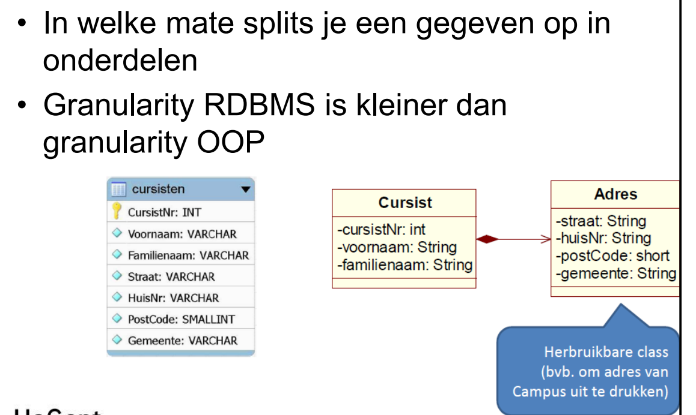
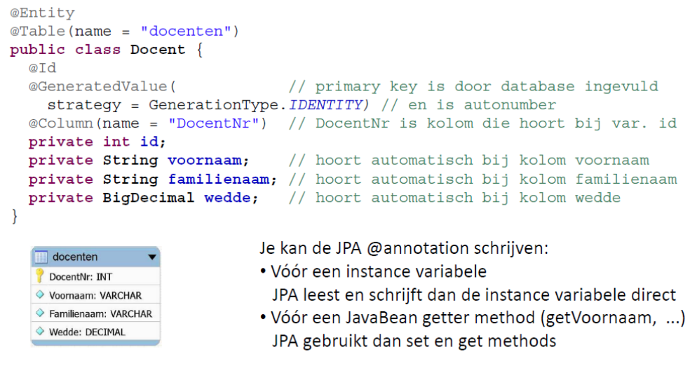
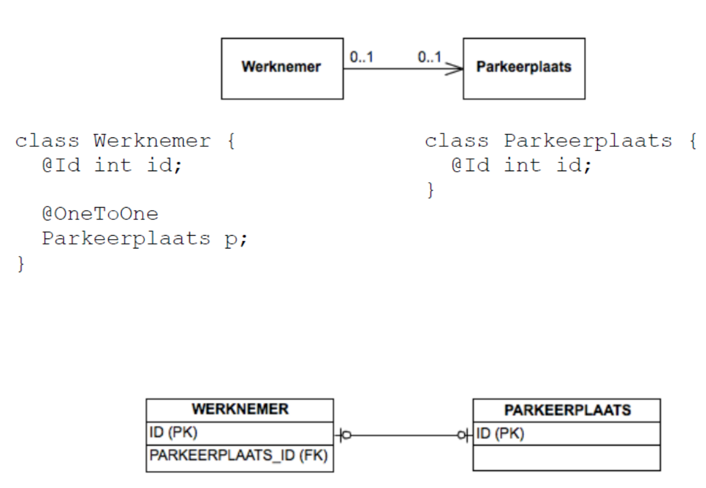
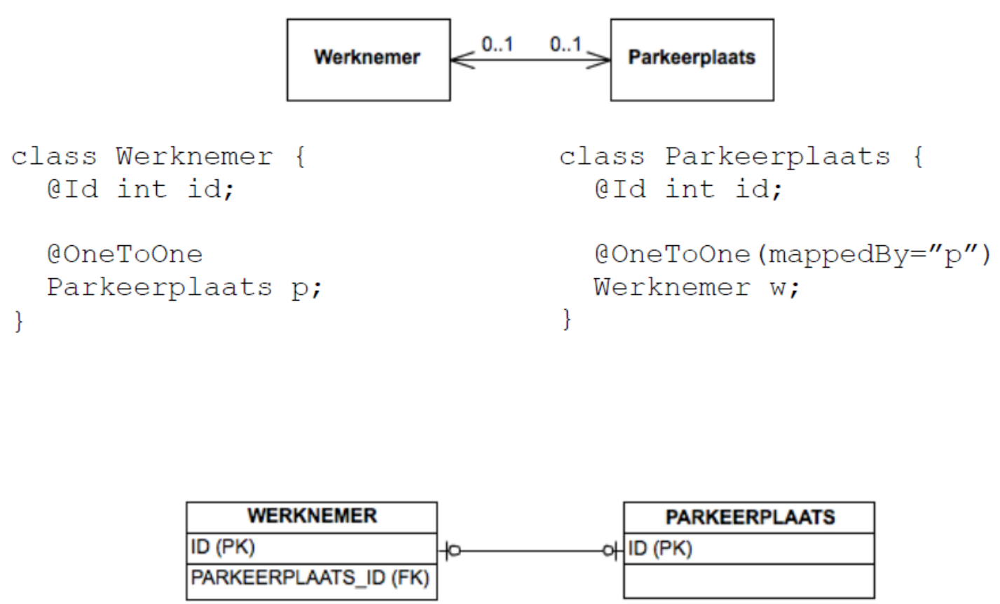
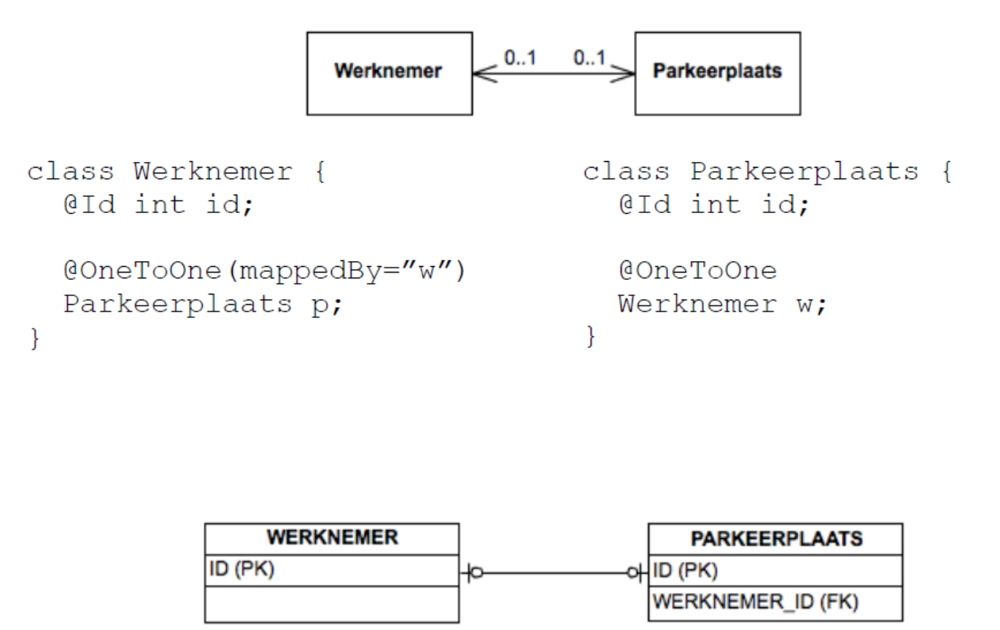

# Java Persistence API (JPA)

## Inleiding (veel bla bla keer doorlezen snel snel)

- JPA -> standaard voor persisteren van objecten in een relationele database
- Ondersteund
  - Object-relational mapping (ORM)
  - Objectgeoriënteerd query (JPQL) -> SQL-achtige taal -> basicly objecten ophalen uit db
  - Schema generatie -> database schema genereren op basis van objectens
- JDBC under de hood (db connectie)
- Deel van java Enterprise Edition (Java EE)
- JPA is een specificatie -> implementatie nodig
  - Hibernate
  - **EclipseLink**
  - OpenJPA
  - ...

## JPA gebruiken in Java SE (veel bla bla gwn bij oef zonder spring boot)
- Configuratie -> persistence.xml
  - src/main/resources/META-INF/persistence.xml
```xml
<?xml version="1.0" encoding="UTF-8" standalone="yes"?>
<persistence xmlns="https://jakarta.ee/xml/ns/persistence"
             xmlns:xsi="http://www.w3.org/2001/XMLSchema-instance"
             xsi:schemaLocation="https://jakarta.ee/xml/ns/persistence https://jakarta.ee/xml/ns/persistence/persistence_3_0.xsd"
             version="3.0">
    <persistence-unit name="EWDJ_JPA_GaragePU" transaction-type="RESOURCE_LOCAL">
        <provider>org.eclipse.persistence.jpa.PersistenceProvider</provider>
        <class>domein.Vervoermiddel</class>
        <class>domein.Onderhoudsbeurt</class>
        <class>domein.Auto</class>
        <class>domein.LichteVracht</class>
        <properties>
            <property name="jakarta.persistence.jdbc.url" value="jdbc:mysql://localhost:3306/garage?serverTimezone=UTC"/>
            <property name="jakarta.persistence.jdbc.password" value="root"/>
            <property name="jakarta.persistence.jdbc.driver" value="com.mysql.cj.jdbc.Driver"/>
            <property name="jakarta.persistence.jdbc.user" value="root"/>
            <property name="jakarta.persistence.schema-generation.database.action" value="drop-and-create"/>
        </properties>
    </persistence-unit>
</persistence>
```
- persistence-unit -> naam van de persistence unit (uniek) -> naam van createEntityManagerFactory (in oef zulde wel zien)
- dan ziede provider staan -> implementatie van JPA -> EclipseLink
- Dan alle klassen die gepersisteerd moeten worden
- en eronder alle properties -> url, user, password, driver, schema-generation.database.action -> drop-and-create -> elke keer als programma start -> drop database en maak nieuwe aan (je hebt ook nog create en none)

### Entity manager
- Toegangspunt tot de persistentielaag
  - beheert entiteiten
  - CRUD operatioes
  - JPQL queries uitvoeren
  - alles gebeurt via deze entity manager


### Persistence context
- Bevat alle entiteiten die gemanaged worden door de entity manager
- Wijzigingen aan entiteiten worden bijgehouden en gesynchroniseerd met de database

- Entiteiten die **behoren** tot de context worden
  _managed entities genoemd._
- Entiteiten die **niet behoren** tot de context worden
  _detached entities genoemd._

### Hoe te gebruiken

```java
Persistence.createEntityManagerFactory(“unitName");
EntityManager em = emf.createEntityManager();
```
> De ”unitName” vervang je uiteraard door de naam van je persistence unit.
> 
> Best gebruik je util klasse om deze te maken en te sluiten
```java
public class JPAUtil {
    
    private static final EntityManagerFactory emf = Persistence.createEntityManagerFactory("persistence-unit-name");
    
    public static EntityManager getEntityManager() {
        return emf.createEntityManager();
    }
    
    public static void close() {
        em.close();
        emf.close();
    }
}
```

> Bewerking die dingen aanpassen in DB -> transactie
```java
em.getTransaction().begin();

// bewerkingen

em.getTransaction().commit();
```

## Object-relational mapping (ORM)
Belangrijkste verschillen
- Granularity zie vb
    - 
- Inheritance -> 1 tabel per klasse of 1 tabel voor alle klassen (overerving)
- Associaties -> 1 op veel, veel op veel, 1 op 1 (relaties)

---------


## JPA entity
- Klasse die naar db gemapt wordt
  - Heeft een @Entity annotatie
  - Heeft een @Id annotatie -> primary key
    - @GeneratedValue -> gegenereerd door db
  - Heeft een default constructor
  - is serializable (implements Serializable)
  - Heeft getters en setters voor alle properties
  - Equals en hashcode methodes Niet op basis van id -> op basis van business key (ander uniek veld)
  - (Niet final class of nested class)

```java
@Entity //Zegt dat het een enitity is
@Table(name = "docenten") //Zegt welke tabel naam deze zal krijgen (optioneel)
public class Docent implements Serializable { //serializable voor JPA

    public static final long serialVersionUID = 1L;
    
    @Id //primary key aanduiden
    @GeneratedValue(strategy = GenerationType.IDENTITY) //zegt dat deze gegenereerd wordt door de db auto increment
    private Long id;
    
    @Column(name = "personeelsnr") //zegt welke kolom naam deze zal krijgen (optioneel)
	private int docentNr;
	
    private String voornaam;
    
    private String familienaam;
    
    private BigDecimal wedde;
    

    public Docent(int docentNr, String voornaam, String familienaam, BigDecimal wedde) {
        this.docentNr = docentNr;
        this.voornaam = voornaam;
        this.familienaam = familienaam;
        this.wedde = wedde;
    }

    //Constructor voor JPA (default constructor)
    protected Docent() {

    }

    public int getDocentNr() {
        return docentNr;
    }

    public String getVoornaam() {
        return voornaam;
    }

    public String getFamilienaam() {
        return familienaam;
    }

    public BigDecimal getWedde() {
        return wedde;
    }

    public void setWedde(BigDecimal wedde) {
        this.wedde = wedde;
    }

    public void opslag(BigDecimal bedrag) {
        wedde = wedde.add(bedrag);
    }

    @Override
    public String toString() {
        return String.format("%d %s %s %s", docentNr, voornaam, familienaam, wedde);
    }

    public void setId(Long id) {
        this.id = id;
    }

    public Long getId() {
        return id;
    }


    //Equals en hashcode op basis van business key (docentNr)
    @Override
    public boolean equals(Object o) {
        if (this == o) return true;
        if (o == null || getClass() != o.getClass()) return false;

        Docent docent = (Docent) o;

        return docentNr == docent.docentNr;
    }

    @Override
    public int hashCode() {
        return docentNr;
    }
}
```


### Mapping met annotaties
| Annotatie                                           | Betekenis                                             |
|-----------------------------------------------------|-------------------------------------------------------|
| @Entity                                             | Klasse is een entity                                  |
| @Table(name = "docenten")                           | Tabelnaam is docenten (optioneel)                     |
| @Id                                                 | Primary key                                           |
| @GeneratedValue(strategy = GenerationType.IDENTITY) | Primary key wordt gegenereerd door de database        |
| @Column(name = "personeelsnr")                      | Kolomnaam is personeelsnr (optioneel)                 |
| @Transient                                          | Property wordt niet gemapt naar een kolom (optioneel) |

### Relaties
(de kant van de relatie die de foreign key bevat is de 'eigenaar' van de relatie
ookwel de owning side genoemd (kant zonder mappedBy)) 

- 1 op 1 -> @OneToOne
  - 2 soorten    
    - Unidirectioneel -> 1 kant
      - Langs 1 kant kan je de andere kant niet weten
      - 
    - Bidirectioneel -> 2 kanten
      - Langs bijde kanten weet je wie de andere is (je hebt een referentie naar de andere)
      - 
      - 


- 1 op veel
  - @OneToMany
  - @ManyToOne
- Veel op veel
  - @ManyToMany